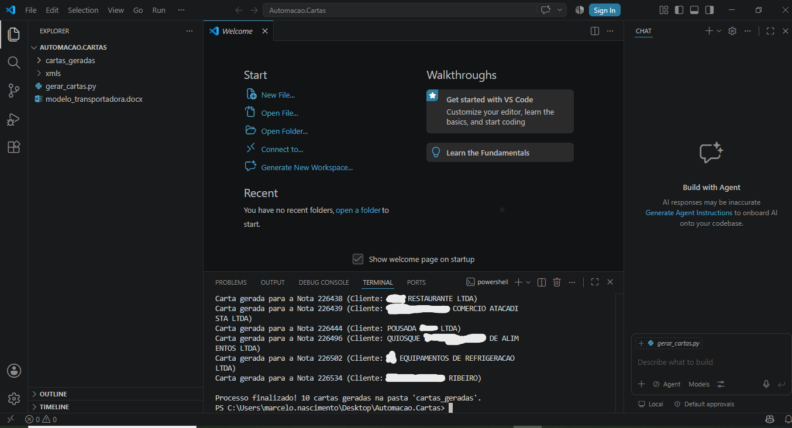

# 🚚 Automação de Termo de Responsabilidade e Isenção (XML NF-e)

## 📌 Visão Geral
Projeto de automação desenvolvido em **Python** no **VS Code** para otimizar o fluxo do setor de Faturamento e Logística. 
O script realiza a leitura de dados estruturados a partir do arquivo XML de uma Nota Fiscal Eletrônica (NF-e) e gera automaticamente a **Carta de Isenção / Termo de Responsabilidade por Quebra de Produtos** pré-preenchida para envio à transportadora.

---

## 🎯 Impacto no Negócio
* ⏱️ **Ganho de Tempo:** Redução do tempo de confecção de ~5 minutos para **menos de 10 segundos**.
* 🎯 **Acurácia de Dados:** **0% de erro de digitação** em CNPJ, chave de acesso e endereço do destinatário.
* ⚡ **Eficiência:** Agilização no processo de sinistro e ressarcimento junto à transportadora.

---

## 📸 Demonstração do Projeto

### 1. Execução do Script em Python (VS Code)

### 2. Documento Final Gerado (Termo de Isenção)

---

## 🛠️ Tecnologias Utilizadas
* **Python**
* **VS Code**

---
> 🛡️ *Nota: Por motivos de confidencialidade e LGPD, o código-fonte integral não está exposto neste repositório, e os dados exibidos nos prints acima são fictícios/para fins de demonstração.*
